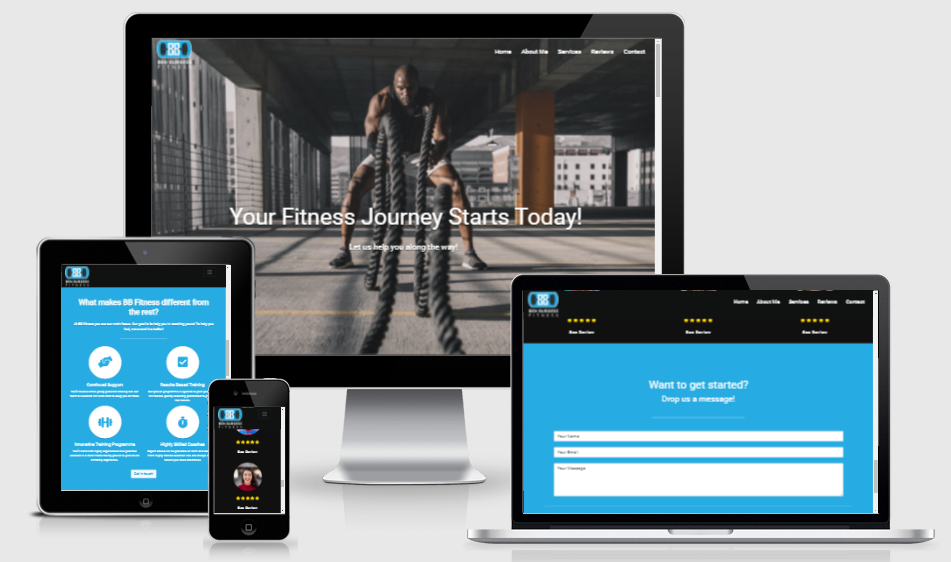
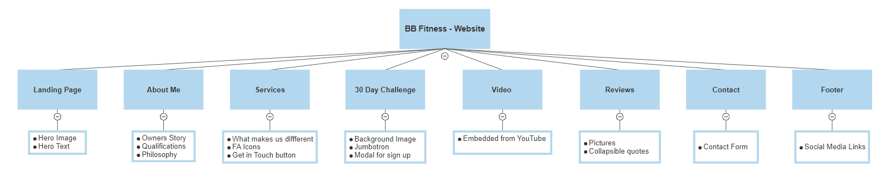

# BB Fitness

[Link to the Live Project](https://samburgess93.github.io/Milestone-1/).

## Table of contents
1. [Introduction](#Introduction)
2. [UX](#UX)
    1. [Ideal User Demographic](#Ideal-User-Demographic)
    2. [User Stories](#User-Stories)
    3. [Development Planes](#Development-Planes)
    4. [Design](#Design)
3. [Features](#Features)
    1. [Design Features](#Design-Features) 
    2. [Existing Features](#Existing-Features)
    3. [Features to Implement in the future](#Features-to-Implement-in-the-future)
4. [Issues and Bugs](#Issues-and-Bugs)
5. [Technologies Used](#Technologies-Used)
     1. [Main Languages Used](#Main-Languages-Used)
     2. [Additional Languages Used](#Additional-Languages-Used)
     3. [Frameworks, Libraries & Programs Used](#Frameworks,-Libraries-&-Programs-Used)
6. [Testing](#Testing)
     1. [Testing.md](TESTING.md)
7. [Deployment](#Deployment)
     1. [Deploying on GitHub Pages](#Deploying-on-GitHub-Pages)
     2. [Forking the Repository](#Forking-the-Repository)
     3. [Creating a Clone](#Creating-a-Clone)
8. [Credits](#Credits)
     1. [Content](#Content)
     2. [Media](#Media)
     3. [Code](#Code)
9. [Acknowledgements](#Acknowledgements)
***

## Introduction
### Milestone project - User Centric Frontend development

This project will be used to promote a Personal Training service. 
The aim is to encourage potential customers to join the movement and sign up to the free 30 day fitness challenge and as a result take up the service long term.

The idea is that by properly describing the story of the trainers own fitness journey (Ben Burgess) this will inspire others who are in the same situation to make the change in their own lives.

[Back to top ⇧](#bb-fitness)

## UX

### Ideal User Demographic
#### The ideal user of this website is:
- Potential clients
- Current clients
- Anyone from ages 16-70

### User Stories
The user of this website will be people who want to increase their own fitness levels and people who can relate to the story of the business owner.
Ages ranging from 18-50 and will be mostly accessed on mobile devices.
The user will want to see the story behind the business and see what services are offered.
The user will want to see how they can get in contact to get started on their journey.

The website will invite the user to interact with a colour scheme and a user-friendly experience. They will be able to sign up for the 30 day challenge and be able to get in touch to start their journey and also have links to the social links.

A user will want to relate to the owners story.
A user will want to see what services are on offer.
A user will want to see more on the tyhe businesses social media platforms.
A user will want to see some customer feedback.
A user will want to see how to get in touch.

### Development Planes
#### Strategy

##### User Needs.
The potential user will need the information contained in the application to be concise and easily accessed. The application will need to be easily navigated by mobile devies such as phones and tablets.

##### Technical Capabilites
This project can be created in the available timeframe using the Bootstrap HTML & CSS framework.

##### Business Vision
The purpose of this project is to introduce new people to the fitness movement. By showing what services can be offered and telling the story of the owner 
the aim is to have people sign up to the free 30 day challenge to sample the services with the desired outcome being a sign up to longer membership afterwards.
With people visiting the site it is envisaged that the social media pages will in turn get more clicks and in turn get more people to join

#### Scope
For the users to my website I wanted to highlight to them that they can change their lives and become a happier and healthier person by signing up for some personal training.

#### Structure
The main structure of the website will be a single page application with a main hero image and text that the user see first whe they visit the site.
On scrolling down the user will come upon the About Me section which tells the story of the owners own battle with weight loss that will bring a sense of togetherness and relatability 
to the application. What follows then is the Services section whcih highlights to the user what they can expect from BB fitness and how this 
differentiates this from others. This will include a call to action button to get in touch to start the process. After the services the user is met with the 30 day fitness challenge
section which will invite the user to sign up for the free fitness programme. Following this is a embedded motivational video to create a positive emotional response from the user.
A review section then follows which showcases what existing clients have to say about BB fitness. This is then followed by the contact form and the footer which contains the links to
the social media channels. 

#### Skeleton

The wireframes were created on figma.com  

Original Wireframes:
Link to wireframes can be found [here](https://www.figma.com/file/1PZ3T115pa96Jw6TOooS29/Milestone-1?node-id=0%3A1).

### Design

#### Colour Scheme
The main colours used throughout the website are a mixture of Black, White and a Light Blue.

This colour scheme was chosen as it's a reflection of the owners official logo and creates a warm inviting feel to the webpage.

#### Typography
For fonts I decided to go with the [Roboto](https://fonts.google.com/specimen/Roboto "Link to Roboto Google Font") font imported from Google fonts. If for some reason the import faield then Sans serif would be used.

[Back to top ⇧](#bb-fitness)

## Features

### Design Features
Each section of the website features a consistent responsive navigational system:
- Within the **Header** there is a **logo** placed in the top left of the page and upon clicking will redirect the user to the main landing page.
- The **navbar** will be 100% transparent when the user is on the landing page. This will become solid when scrolled down.
- On mobile devices the navbar will collapse into a **toggle** button and upon clicking will reveal the naviagtion links.

<dl>
  <dt><a href="index.html" target="_blank" alt="BB Fitness Home Page">Home Page</a></dt>
  <dd>
     <ul>
          <li><strong>About Me </strong> - Occupying 50% of the page width on desktop and 100% on mobiles devices. The imagery used was specifically chosen as it created a impactful first impression, setting the tone of the website for the user.
          </li>
          <li><strong>Hero Text</strong> - Set on top of the <strong>Hero Image</strong> running across it. On mobile and tablet devices, the text becomes stacked. The purpose of the text is to provide an area in the center to draw in the users attention and create a positive emotional response from the user. 
          </li>
     </ul>
  </dd>

  <dt><a href="#about-me" target="_blank" alt="BB Fitness Home Page">About Me Page</a></dt>
  <dd> The About Me page is two columns wide on desktops and one column wide on mobile and tablet devices.
     <ul>
          <li><strong>About Me Section</strong> - Occupying 50% of the page width, on the left side, while viewing on a desktop. On mobile and tablet devices, the image becomes stacked at the top of the page, occupying 100% of the page width. This section illustrates the owners own fitness journey which will allow the user to relate to the story.
          </li>
          <li><strong>Comparison Image</strong> - Occupying 50% of the width, on the right side, while viewing on a desktop. On mobile and tablet devices, the container becomes stacked. Thispicture shows the owner himself has lost weight further helping the user to relate.
          </li>
          <li><strong>Coaching Image</strong> - Occupying 50% of the page width, on the left side, while viewing on a desktop. On mobile and tablet devices, the image becomes stacked, occupying 100% of the page width. This section illustrates shows the owner in a personal training setting showing the user his experience in coaching others.
          </li>
          <li><strong>Qualifications</strong> - Occupying 50% of the width, on the right side, while viewing on a desktop. On mobile and tablet devices, the container becomes stacked. The container provides the qualifications of the trainer. This information was styled in a list with bullet points.
          </li>
          <li><strong>Philosophy</strong> - Occupying 50% of the width, on the right side, under the qualifications while viewing on a desktop. On mobile and tablet devices, the container becomes stacked. The container provides some quotes that the trainer bases their own philosophy on.  This information was styled in a list with bullet points.
          </li>
     </ul>
  </dd>

  <dt><a href="#services" target="_blank" alt="BB Fitness Home Page">Services</a></dt>
  <dd>The Services page has a blue background to clearly seperate it from the About me section.
     <ul> 
          <li><strong>Heading</strong> - Occupying 100% of the page width on all devices. The heading asks the user a question which is answered in the following information,grabbing the users attention.
          </li>
          <li><strong>Service Items</strong> - There are 4 service item sections each being illustrated with a Font Awesome icon and some associated text. On desktop these 4 sections are laid horizontally across the webpages. On medium screens the sections are laid in a 2x2 grid. On small screens the sections are stacked horizontally.
          </li>
          <li><strong>Get in touch</strong> - A call to action button that invites the user to interact. The button brings the user to the contact form section.
          </li>
     </ul>
  </dd>

  <dt><a href="#challenge" target="_blank" alt="BB Fitness Home Page">30 Day Challenge</a></dt>
  <dd>The aim of the 30 Day challenge section is to get the user to sign up to the free challenge in the expectation that they will want to sign up for longer afterwards after a positive experience.
     <ul> 
          <li><strong>Heading</strong> - Occupying 100% of the page width on all devices. The heading asks the user a question which is answered in the following information,grabbing the users attention.
          </li>
          <li><strong>Service Items</strong> - There are 4 service item sections each being illustrated with a Font Awesome icon and some associated text. On desktop these 4 sections are laid horizontally across the webpages. On medium screens the sections are laid in a 2x2 grid. On small screens the sections are stacked horizontally.
          </li>
          <li><strong>Get in touch</strong> - A call to action button that invites the user to interact. The button brings the user to the contact form section.
          </li>
     </ul>
    </dd>

  <dt><a href="#video" target="_blank" alt="BB Fitness Home Page">Video</a></dt>
  <dd>The aim of the video is to get the user motivated to make the change in their own lives. The video is embedded from YouTube and the size is responsive and adapts to whatever size of screen its being viewed on.
    </dd>

  <dt><a href="#reviews" target="_blank" alt="BB Fitness Home Page">Reviews</a></dt>
  <dd>The idea behind the review section is that potenital new customers will be able to see what existing customers think of the services offered. There is 3 reviews in total. On large screens the 3 reviews wil be laid out horizontally across the screen. On meduim sized screens two wil occupy the top row and with one centred below.
     <ul> 
          <li><strong>Images</strong> - Each review shows a picture of the person that wrote it creating a more personal human touch for the user.
          </li>
          <li><strong>Icons</strong> - 5 star icons imported from Font Awesome represent the rating given by the reviewer.
          </li>
          <li><strong>Review</strong> - A 'show review' button allows the review itself to be expanded and collapsed again.
          </li>
     </ul>
    </dd>

  <dt><a href="#contact" target="_blank" alt="BB Fitness Home Page">Contact</a></dt>
  <dd>The contact section will be the final section before the footer. This offers the user an oppurtunity to get in contact with the business to start their fitness journey. Theres a name, email and message field all of which are required fields. There is a send button at the bottom which changes state as the user hovers over with their mouse inviting them to click.

  <dt><a href="#footer" target="_blank" alt="BB Fitness Home Page">Footer</a></dt>
  <dd>The footer gives the user easy access to the social media links for the business to learn more. Links to Facebook, Instagram and Twitter are available.
    </dd>

### Existing Features
- Header Logo - Appearing in navabr and remains in top left of screen at the user scrolls. Clicking on the logo will return the users to the home page, as expected.

- Header Navigation Bar - Fixed to the top of the page as the user scrolls down. Its clear at the top of the to enhance the impact of the Hero Image but becomes solid down the page to ensure the navigation links are clear and accessible. On smaller screens the navbar icons collapse into a toggler button.

- Social Media Icons - Appearing in the footer, the icons represent the relevant Social Media platforms, allowing the user to learn more. Upon hovering over the icons they change colour.

- YouTube Embed - iframe element for a video uploaded to YouTube, showcasing a motivational video for the user to enjoy. The bootstrap resonsive class was utilised to make sure the video size was dynamic depedning on what device screen size was being used. 

- Collapsible Reviews - The customer reviews are expandable and collapsible to make the section cleaner and create an enhanced user experience.

### Features Left to Implement
- Members forum so people can interact and encourage each other.

- Email confirmation for successful sign up to challenge.

- Create a multi page app with a gallery of pictures.

[Back to top ⇧](#bb-fitness)

## Technologies Used
- HTML5
- CSS3
- JQuery
- Google Chrome Developer Tools
- Bootsrap v4.3.1
- Google Lighthouse for audits

## Testing

### Testing planning.
At the start of the project I had to take into account the needs of the user and the devies they would be using to view the application.

Using Chrome tools I tested using the following devices;

- iPhone 5/SE (320 x 568)
- iPhone 6/7/8 (375 x 667)
- iPhone 6/7/8 Plus (414 x 716)
- iPhone X (375 x 812)
- iPad (768 x 1024)
- iPad Pro (1024 x 1366)
- Laptop with HiDPI Screen (1440 x 900)

I tested with other screens I have also;
- Samsung S9 mobile
- 23.8" Desktop Screen (1920 x 1080)
- Laptop 14" (1920 x 1080)

### Implementation
I used Google Chrome dev tools to debug and test my code. I used the 'mobile first' approach so I debugged on the smallest screen first and worked my way up to the largest. 
I also tested using the handheld devices I owned to make the testing more accurate.

The main method of testing I used was implenting/ changing styles in the Chrome Dev Tools first to see how it looked on various device sizes. If this was satisfactory then I would paste the code over to my HTML/CSS to make the change permanent.

I also used Lighthouse to test the accessability of the site and W3 validator to test my code.

### Results and outcomes

### Validator

I used the W3C Validator to check my HTML code. The first error I encountered was that in my embedded code for the YouTube video the frameborder attribute is obselete in HTML5. I had to implement this is in my CSS instead.

### Deployment

## Bugs

## Credits

### Content

### Acknowledgements

**This project is for educational use only and was created specifcally for the Code Institute Module of User Centric front end development**

**Created by Sam Burgess**